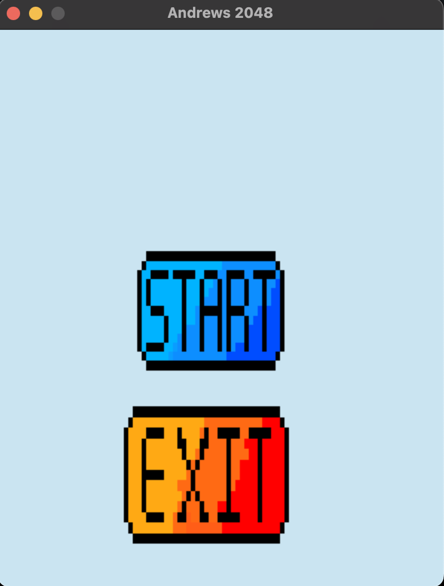
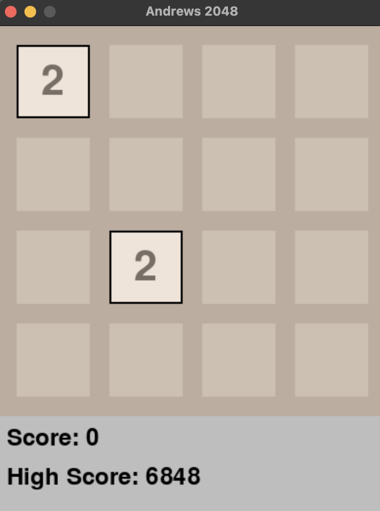
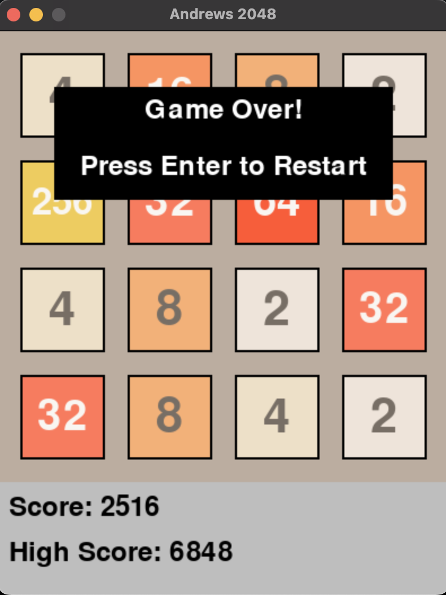

# AlgoProFinalProject
Andrew Sebastian Sibuea 
NIM 2602169711

Here is here i got the idea on making the game:
https://www.geeksforgeeks.org/2048-game-in-python/

Link to my google docs (report/documentation):
https://docs.google.com/document/d/1MJMKA2-zRXiz45Y2imINLvmFukdQHjH2MLzmqODSzkU/edit?usp=sharing

Link to the demo video:
https://drive.google.com/file/d/1qrMPX1bXynxj5XMjrKju_sBxdLyXhprS/view?usp=share_link

## Brief description of the game:
2048 is a single-player puzzle game where the goal is to combine numbered tiles on a grid to create a tile with the number 2048. The game starts with a 4x4 grid with two randomly placed tiles, each with the number 2. On each turn, the player can move all tiles in one of the four directions (up, down, left, right) and when two tiles with the same number touch each other, they merge into one tile with the value of the sum of the two tiles. The game is won when a tile with the number 2048 is created, and the game is lost when there are no more possible moves. The game is known for its simple yet addictive gameplay, as well as it's potential to teach problem-solving and logical thinking.

## Screenshots

